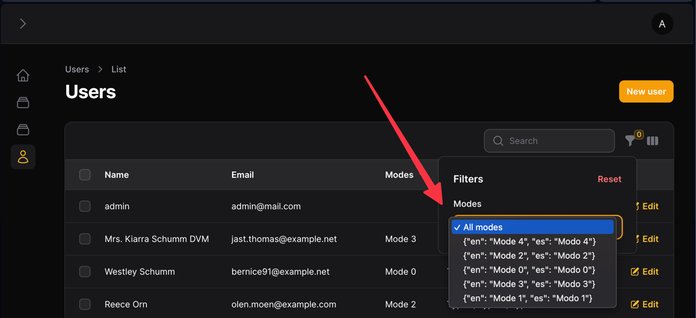
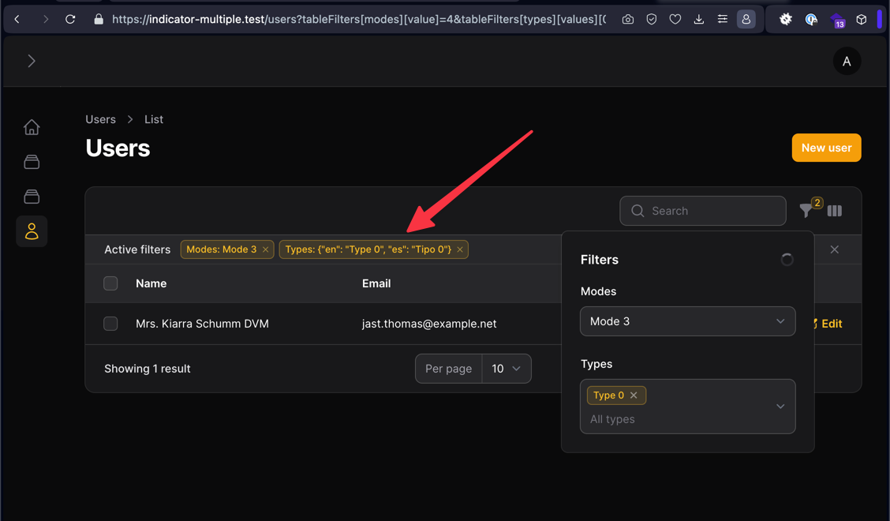

This repo is made to debug an error in the filter indicator label when using translations.


## How to install
1. Clone the repo
2. Run composer install
3. Run migrations
4. Run seed

To enter filament admin use:

user: admin@mail.com

pass: admin

## How to reproduce the error

This repo has a User resource which has two relationships with translatable names:
- Types
- Modes

We set the relationships in filament to allow multiple Types per user and just one Mode.

We create table filters allowing multiple Types and one Mode.

To show the locale version of the name of the type and model, we need to modify the option label adding this
```
->getOptionLabelFromRecordUsing(fn($record) => $record->name),
```

Otherwise, will be shown like this



This didn't happen in Filament v2

---

But the issue I don't know how to solve is that the indicator of a SelectFilter with the option **multiple** will show the json.

The indicator of a filter without multiple, will work the way it's supposed to.



